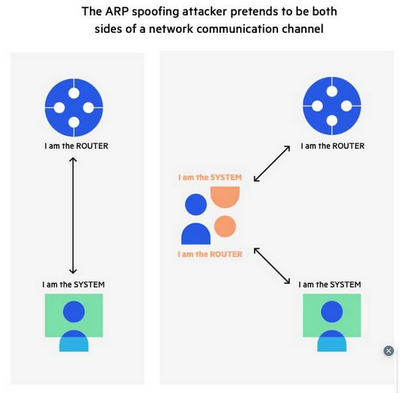
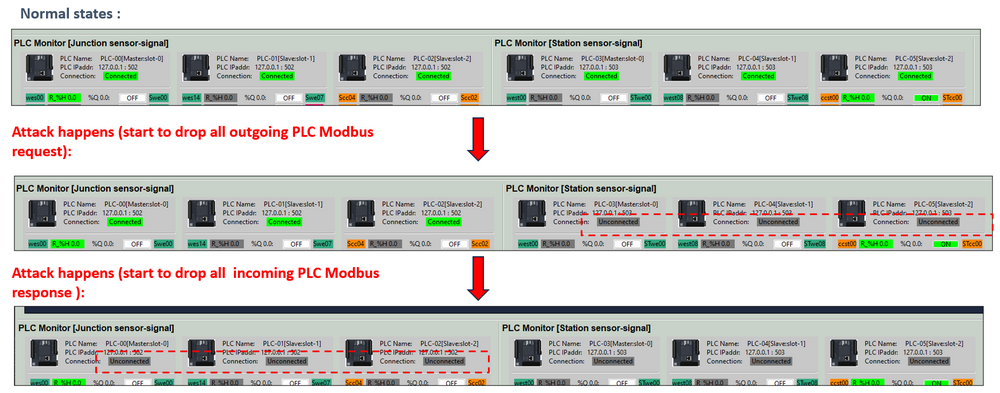
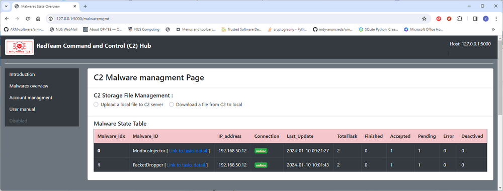

# OT Cyber Attack Demo on HMI  [Case Study 02] : ARP Spoofing Attack Case

**Project Design Purpose** : The objective of this case study is to develop a demonstration and workshop utilizing the Railway (Metro) IT/OT System Cyber Security Test Platform, the Red Team Command and Control (C2) System and the Ettercap Wrapper for APR Spoofing attack on OT system.  Our aim is to showcase how a hacker (red team member) could potentially launch an ARP Spoofing Attack on the OT system Human Machine Interface (HMI) which caused the Operation Room HQ offline.  This particular attack scenario is proposed as one of the demonstration cases for the Cross Sword 2023 Test-Run, providing a realistic and controlled environment to assess the cybersecurity resilience of the railway infrastructure.

**Attacker Vector** :  ARP Spoofing / Network Traffic Blocking / attack on specific App.

> Important : The demonstrated attack case is used for education and training for different level of IT-OT cyber security ICS course, please don't apply it on any real world system.

[TOC]

------

### Introduction

The attack study case comprises three sub-projects :

- Railway[Metro] IT/OT System Mini Cyber Range System [link of project document](https://github.com/LiuYuancheng/Railway_IT_OT_System_Cyber_Security_Platform)
- Red Team C2 Emulation system [link of project document](https://github.com/LiuYuancheng/Python_Malwares_Repo/tree/main/src/c2Emulator)
- Ettercap Wrapper program [link of project document](https://github.com/LiuYuancheng/Python_Malwares_Repo/tree/main/src/ettercapWrapper)

In this study case, we envision a scenario where a red team attacker/hacker successfully implants the Packet Dropper and Mitm Tool Ettercap via an IT-Attack, such as employing a phishing email, targeting one of the maintenance computers in the SCADA supervision network. The attack study case will illustrate how a red team attacker, external to the railway mini cyber range, executes Ettercap to broadcast the fake ARP to one Operation HMI computer and the related PLCs, then apply the packet filter to drop the specific package (ModBus-TCP packet to port 502) to changes the Operation room one HMI program offline. This will be accomplished by utilizing the Red Team C2 system from the internet and successfully bypassing the firewall's detection mechanisms.

The attack detailed road map is shown below : 


##### Key Tactics, techniques, and procedures (TTP) of the attack

Based on the attack detailed road map there will 4 TTP of the attack scenario : 

**Remote Attack Control**

- **Tactics** : Centralized Program Control  
- **Techniques** : Use A Command and Control (C2) system that enables attackers to manage and control compromised systems.
- **Procedures**: The red team attacker will remotely control the Malicious-Action-Programs through RTC2's web-UI, the attack control can be from any location of the internet. 

**Camouflage the Communication**

- **Tactics** : Traffic Encryption and Obfuscation
- **Techniques** : Using encryption algorithms to protect control messages and employing obfuscation methods to make the encrypted data more challenging to interpret.
- **Procedures :**To camouflage the communication, all interactions between the Malicious-Action-Programs and the Command and Control (C2) system will be disguised as standard HTTPS POST requests and responses. Notably, the package size will be kept minimal (less than 1KB) to prevent triggering the firewall's alert mechanisms related to download/upload activities.

**ARP Cache Poisoning**

- **Tactic:** Manipulating ARP tables.
- **Technique:** Sending forged ARP packets to associate the attacker's MAC address with the IP address of a target system, causing the ARP cache on other devices to be poisoned.
- **Procedures** : Use Ettercap to broadcast the fake ARP message to the targeted operation room HMI host machine and the switch (router) of the supervision network to poisoning the ARP cache table of these 2 nodes to redirect the traffic between HMI host and switch/router to the attack launch machine.

**Denial of Service (DoS)**

- **Tactic:** Disrupting normal network operations.

- **Technique:** Flooding the network with ARP spoofed packets can lead to a breakdown in network communication, causing denial of service for legitimate users.

- **Procedures** : After the ARP Cache Poisoning attack successful, apply the specific network packet drop filter (Modbus) to packets to denial/block the HMI to PLC communicate without make influence of other traffic. 

  

------

### Background Knowledge 

Within this section, we aim to provide fundamental, general knowledge about each respective system and elucidate the Tactics, Techniques, and Procedures (TTP) associated with the attack vectors. This foundational information will serve as a primer for understanding the intricate details of the systems involved and the methodologies employed in the attack scenarios.

##### ARP Spoofing Attack

Address Resolution Protocol (ARP) is a protocol that enables network communications to reach a specific device on the network. ARP translates Internet Protocol (IP) addresses to a Media [Access Control ](https://www.imperva.com/learn/application-security/broken-object-level-authorization-bola/)(MAC) address, and vice versa. Most commonly, devices use ARP to contact the router or gateway that enables them to connect to the Internet.

ARP (Address Resolution Protocol) spoofing, also known as ARP poisoning, is a network attack in which an attacker sends fake ARP messages to the local area network. The goal of ARP spoofing is to associate the attacker's MAC (Media Access Control) address with the IP address of a legitimate network device, causing network traffic to be redirected to the attacker. This can lead to various malicious activities, such as man-in-the-middle attacks, eavesdropping, or session hijacking. A Basic APR spoofing attack diagram is shown below: 



Reference: https://www.imperva.com/learn/application-security/arp-spoofing/

##### Railway[Metro] IT/OT Mini Cyber Range System

For the Railway IT/OT System general introduction please refer refer to the [study case 1](OT_attack_case1_falseCmdInjection.md), system diagram:


he Railway System SCADA HMI is part of the Railway IT/OT System security test platform, it is the ARP attack target, the program is running on one work station in the system's supervision network, operation room. It is used to monitor the whole railway tracks sensors-signal auto control system. The Main UI is shown below :


The HMI contents below components and function:

- A train sensors-signal relation map to show sensors state, signals state and the sensors-signals auto control relation ship (tracks-cross-junction and train-stations). 
- Three PLC panel to show the junction-sensor-signal control system's Digital Input/Output state, PLC holding register state and the PLC Coils state. 
- Three PLC panel to shoe the station-sensor-signal control system's Digital Input/Output state, PLC holding register state and the PLC Coils state. 

For the HMI system detail please refer to this document : [SCADA-HMI-1_DOC](https://github.com/LiuYuancheng/Railway_IT_OT_System_Cyber_Security_Platform/blob/main/doc/scadaHMI_readme.md)

##### Red Team C2 Emulation System

For the The Red Team Command and Control (RTC2) server, please refer to the introduction in case study 1

##### Ettercap Packet Dropper

This Ettercap wrapper ARP Spoofing malware is used to let the red team attacker can apply different kinds of packet filter on the network traffic via using Ettercap's ARP spoofing function on the router/switch to launch the packet drop, traffic block or even man in the middle attack. The ARP spoofing attacker is extended from the standard c2BackdoorTrojan module `<c2TestMalware>`by adding the our customized Ettercap Wrapper module, so the C2 Emulation system control it broad cast the ARP poisoning message to the railway HMI mode, the operational room subnet's switch/router and the related connected PLC sets.

The attacker will apply a packets filter to the traffic between the Railway-SCADA-HMI and 2 PLC sets (traffic junction sensor-signal control PLCx3 and the station sensor-signal) to drop all the Modbus traffic packets to denial the railway HMI's state monitoring service. 

> Ettercap wrapper attack program repo: [GitHub Repo ](https://github.com/LiuYuancheng/Python_Malwares_Repo/tree/main/src/ettercapWrapper)


------

### Railway Operation and Attack Procedures 

#### Train Operation Basic Background Knowledge Introduction 


There will be a brief workshop to precede the implementation of the attack, providing an introduction to the fundamental control aspects of trains within the railway system. The cyber range network topology for the train simulation is depicted below:


##### Railway Sensor-Signal SCADA-HMI Introduction

The program contents 2 main part: 

- Main user interface thread : HMI map to show the junctions and stations' sensor-signal state, junction control PLC set [PLC-00, PLC-01 and PLC-02] state with the digital I/O information, station control PLC set [PLC-03, PLC-04 and PLC-05] state with the digital I/O information.
- PLC Communication thread : communicate with the Railway Junctions Sensor-Signal System Control PLC Simulator and Railway Stations Sensor-Signal System Control PLC Simulator through Modbus TCP to get the OT data.

This is the program modules workflow diagram: 


So during the attack, to denial the HMI service, we need to drop both of the 2 Modbus communication channel. 

#### OT-Attack Procedures 

In this demo, the attack tool Ettercap will be pre-installed by the previous IT-system-attack. As introduced in the previous section, we are required to implement 2 types of attacker : Arp spoofing and packet drop. The effected VMs in the OT network is shown below: 


The attack demo will show a Ettercap wrapper program to do the ARP poisoning to the railway  OT sensor-signal system control chain: `Railway Sensor-Signal Control HMI` -> `SCADA sypervision network router` -> `Junction control PLCs & sitation control signals` . The attacker will apply a packets filter to the traffic between the Railway-SCADA-HMI and 2 PLCs(junction and station) to drop all the Modbus traffic packets to cut off the connection of railway state monitoring system.

**Observation during the attack :**

- When the attack happens, the Railway SCADA HMI PLC connection indicators will show total lose connection. All the data on the railway-SCADA-HMI will not update.
- The railway HQ operator is able to detect the attack. But if he tries to use ping or other not Modbus(TCP-port 502) to test the network connection, he will not find any network problem.

The effect detail is shown below:



When the attack happens, the railway HQ operator may observe below situation :

- All the data on the railway-SCADA-HMI will not update. 

- The PLC connection indicators on railway-SCADA-HMI will show lose connection (change from green color to gray color). 


------

### Red Team Attack Detail Steps

Given that the red team attackers operate outside the railway cyber range network, they rely on the attack control Command and Control (C2) system to execute the assault. As detailed in the Attack Pre-condition Introduction section, the ARP spoofing attacker program has been previously deployed on one of the maintenance computers within the cyber range. Consequently, when the red team attacker accesses the C2 system, they will see the ARP spoofing attacker program "packetDropper" has been registered in the C2 as shown below : 



##### Start APR Spoofing Packet Drop Attack from C2

Select the PacketDropper control page, then select the **Assign a special task via Json**, then fill in the task detail : 

- TaskType: `packetDrop`
- Repeat: `1`
- Tasks data: `packetDropper <filter name>`


Press the `submit` button, when the Ettercap wrapper report the task running,the Ettercap will applied the filter to keep block the traffic which incoming or outgoing the target. For the target information, please refer to the filter.json file, below is one dropper filter example, you can create your own filter and put in the filters folder and give a filter unique name in the filter.json file so you can apply it on the traffic:

```
"packetDropper" : {
    "ipaddress": "10.107.107.5",
    "protocalType": "TCP",
    "port":502,
    "description": "Drop all the packets from and to the IP address",
    "filterFile": "atk.ef"
}
```

##### Attack Demo Video

To check the demo video, please refer to this link in my you tube channel: https://www.youtube.com/watch?v=QmB0nJU1_q4


------

#### Problem and Solution

Refer to `doc/ProblemAndSolution.md`


------

> Last edit by LiuYuancheng(liu_yuan_cheng@hotmail.com) at 13/01/2024, if you have any problem, please send me a message.  Copyright (c) 2023 LiuYuancheng