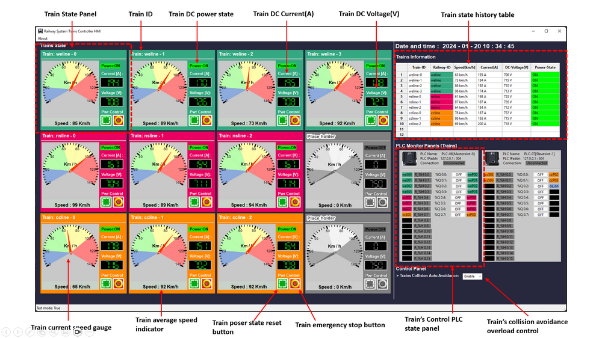
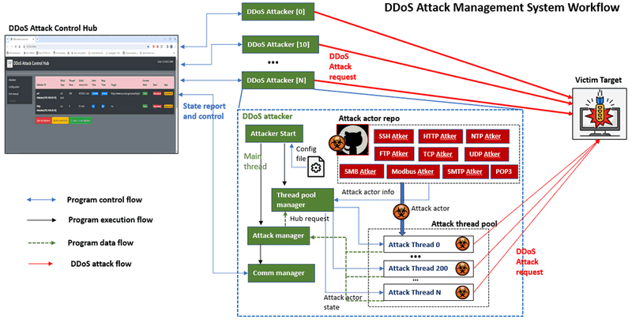
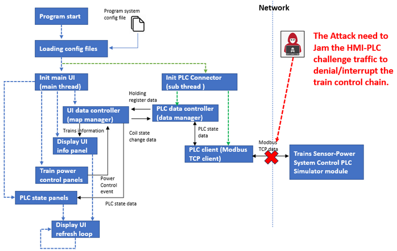
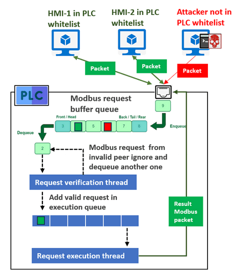
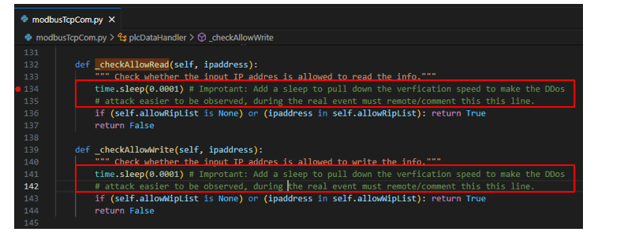
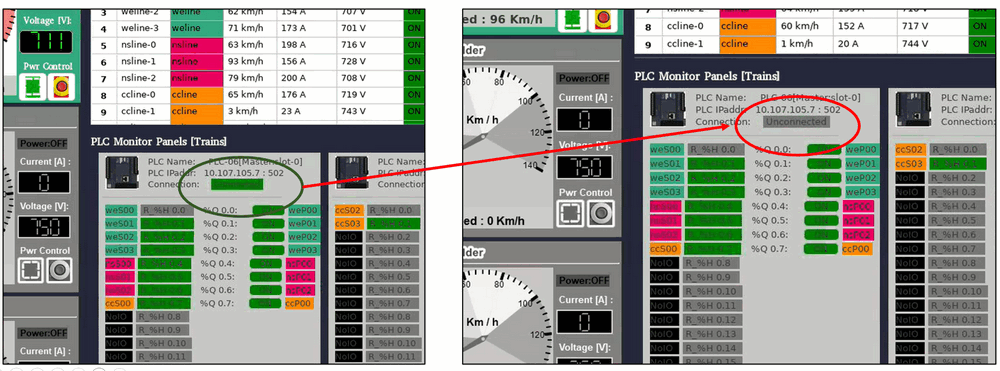

# OT Cyber Attack Demo on PLC [ Case Study 03 ] : DDoS Attack Case

**Project Design Purpose** : The objective of this case study is to develop a workshop which utilizing the Railway (Metro) IT/OT System Cyber Security Test Platform (mini cyber range) , DDoS Attack Management System and DDoS PLC (Modbus-TCP) Attacker Program for demonstrating how the IT distributed denial-of-service attack can make influence on the OT system. Our aim is to showcase how a hacker (cyber range red team member) could potentially launch a DDoS attack targets to the OT Programable Logic Controller which caused interruption on the SCADA-HMI-PLC control chain. This particular attack scenario is proposed as one of the demonstration cases for the Cross Sword 2023 Test/Partners-Run, providing a realistic and controlled environment to assess the cybersecurity resilience of the railway infrastructure.

**Attacker Vector** :  Distributed denial-of-service attack

>  Important : The demonstrated attack case is used for education and training for different level of IT-OT cyber security ICS course, please don't apply it on any real world system.

[TOC]

------

### Introduction

The attack study case comprises three sub-projects :

- Railway[Metro] IT/OT System Mini Cyber Range System [> Link of project document](https://github.com/LiuYuancheng/Railway_IT_OT_System_Cyber_Security_Platform)
- DDoS Attack Management System [> Link of project document](https://github.com/LiuYuancheng/Python_Malwares_Repo/blob/main/src/ddosAttacker/readme.md)
- DDoS PLC(Modbus-TCP) Attacker program  [> Link of project document](https://github.com/LiuYuancheng/Python_Malwares_Repo/blob/main/src/ddosPlcAttacker/readme.md)

In this study case, we envision a scenario where a red team attacker/hacker successfully implants the DDoS-Attack-Program on several computers in the railway company cooperate network, the supervision network and even the production network via an IT-Network-Attack (such as employing a phishing email). The target is one of the PLCs in the production network which controls the trains.  The attack study case will illustrate how a red team attacker, external to the railway mini cyber range, control multiple DDoS attacker programs to launch the DDoS Modbus-TCP requests attack simultaneously to Interrupt the normally OT HMI-PLC control chain.  The attack control will be accomplished by utilizing the Red Team C2 DDoS Attack Management System from the internet and successfully bypassing the firewall's detection mechanisms.

The attack detailed road map is shown below : 


##### Key Tactics, Techniques, and Procedures (TTP) of the attack

Based on the attack detailed road map there will four kinds of TTP are included in the DDoS attack scenario : 

**Botnets:**

- **Tactic:** Enlist a large number of compromised devices to form a botnet.
- **Technique:** Malicious actors infect and control a network of computers, servers, or IoT devices (botnet) to generate and send a massive volume of traffic to the target.
- **Procedures**: To simulate the botnets DDoS attack, we configured at least three nodes in different network to send high frequency Modbus-TCP request to the target PLC. 

**Amplification Attacks:**

- **Tactic:** Increase the volume of attack traffic.
- **Technique:** Exploit protocols that allow a small request to trigger a much larger response. Examples include DNS amplification, NTP amplification, and SNMP reflection attacks.
- **Procedures** : Each  DDoS attacker will parallel start as much thread (100+) as possible to fully use the nodes' network bandwidth to sending the request simultaneously. The totally request volume will be about 80k ~ 120K requests / min.

**Layer 7 Attacks (Application Layer):**

- **Tactic:** Exploit vulnerabilities in the application layer.
- **Technique:** Target specific applications or services to exhaust server resources. Examples include HTTP floods, Slowloris attacks, and application-specific exploits.
- **Procedures**: The attack is targeting the PCL's firmware via Modbus-TCP floods request, Modbus-TCP protocol is an Ethernet-based variant of the Modbus protocol, which is commonly used in industrial automation systems for communication between programmable logic controllers (PLCs), computers, and other devices. It is designed to operate over TCP/IP networks and is used for reading and writing data between devices in real-time industrial applications.

**Bot Spoofing and Obfuscation:**

- **Tactic:** Evade detection and analysis.
- **Technique:** Employ techniques to make the malicious traffic appear more legitimate, such as using diverse user agents, randomizing payloads, or mimicking legitimate user behavior.
- **Procedures :**To camouflage the communication between attacker programs and the RTC2 hub, all interactions between the Malicious-Action-Programs and the Command and Control (C2) system will be disguised as standard HTTPS POST requests and responses, the key control message will be encrypted via pre-set session key. Notably, the package size will be kept minimal (less than 1KB) to prevent triggering the firewall's alert mechanisms related to download/upload activities.


------

### Background Knowledge 

Within this section, we aim to provide fundamental, general knowledge about each respective system and elucidate the Tactics, Techniques, and Procedures (TTP) associated with the attack vectors. This foundational information will serve as a primer for understanding the intricate details of the systems involved and the methodologies employed in the attack scenarios. We will introduce 4 main parts so you can got more detailed information about the whole case study :

1. Distributed denial-of-service attack background knowledge 
2. Railway[Metro] IT/OT Mini Cyber Range System and The Train Control HMI System 
3. C2 Based DDoS Attack Management System
4. Modbus-TCP PLC DDoS attacker Program


##### Distributed denial-of-service attack

A distributed denial-of-service (DDoS) attack is a malicious attempt to disrupt the normal traffic of a targeted server, service or network by overwhelming the target or its surrounding infrastructure with a flood of Internet traffic.

DDoS attacks achieve effectiveness by utilizing multiple compromised computer systems as sources of attack traffic. Exploited machines can include computers and other networked resources such as [IoT devices](https://www.cloudflare.com/learning/ddos/glossary/internet-of-things-iot/).

From a high level, a DDoS attack is like an unexpected traffic jam clogging up the highway, preventing regular traffic from arriving at its destination. A basic application later DDoS attack diagram is shown below: 


>  Reference: https://www.cloudflare.com/learning/ddos/what-is-a-ddos-attack/


##### Railway[Metro] IT/OT Mini Cyber Range System

For the Railway IT/OT System general introduction please refer refer to the [study case 1](OT_attack_case1_falseCmdInjection.md), the cyber range system diagram is shown below:


In this attack case study, the effected system are one of the train control monitoring HMI(Human-Machine Interface) and one PLC set. 

**Human-Machine Interface**: In the context of industrial automation and control systems, OT HMI refers to the Human-Machine Interface used in Operational Technology (OT) environments. OT encompasses the technologies and systems used to monitor and control physical devices, processes, and infrastructure in sectors like manufacturing, energy, utilities, and transportation.

**Targeted Host/App/Service** : In this attack case study, as shown in the the `Attack detailed road map`  the target is on of the trains control PLC in the production network of Railway IT/OT Mini Cyber Range and the Train control HMI which is running on one work station in the system's supervision network ( operation room ).  It provides a graphical representation of the operational status, real-time data, and control options, allowing operators to monitor and manage industrial processes efficiently  monitor for the HQ operator to monitor the Trains speed, power, brake, voltage and current information and the Train Operator/Driver can also control the train via the HMI. The Main UI is shown below :



The Trains Control HMI contents below components and function:

- Trains information panel with a gauge to show the trains related information: Train-ID, Speed, Current, Voltage and power state.
- Trains Power control button for use to reset or turn off the trains' power.
- PLC state display panel to show the state of holding registers and output coils.

> For the HMI system detail please refer to this document :  [TRAIN-HMI-1 DOC](https://github.com/LiuYuancheng/Railway_IT_OT_System_Cyber_Security_Platform/blob/main/doc/trainsCtrlHMI.md)


##### DDoS Attack Management System

DDoS attacks achieve effectiveness by utilizing multiple compromised computer systems as sources of attack traffic. Exploited machines can include computers and other networked resources such as [IoT devices](https://www.cloudflare.com/learning/ddos/glossary/internet-of-things-iot/). We want to create a distributed DDoS attack launch system which contents one DDoS attack actors repository, several DDoS attackers and one attack control hub. The system structure overview is shown below :


1. The **DDoS Attacker** program is running on single nodes with a attack thread pool to start several hundreds of parallel threads to implement the attack at the same time based on the user's config. Currently we provide 10 different categories service attack actors and user can also easily plug their customized attack program in the attacker.
2. The **DDoS Attack Actors** **Repository** contents several attack actors to send different kinds of network request (such SSH, https-GET, https-POST, SMB login...) to the target. Each attack actor object will be assembled in a attack thread and put in to the attack pool of the related DDoS attacker.
3. The **DDos Control Hub** is used to link all the DDoS attackers together so the user can monitor the current attack state and control each DDoS attacker via the hub's web interface.

>  For the detail system design, please refer to the project repo: [DDOS Management System Repo](https://github.com/LiuYuancheng/Python_Malwares_Repo/tree/main/src/ddosAttacker)


##### Modbus-TCP PLC DDoS Attacker

This PLC DDoS attack program is modified from the standard DDoS attack program `<DDoSattacker.py>` [source_code](https://github.com/LiuYuancheng/Python_Malwares_Repo/blob/main/src/ddosAttacker/ddosAttacker.py)  by adding the PLC Modbus-TCP communication module. As it inherited the standard DDoS attacker program, the red team attackers can use our [DDoS C2 Hub](https://github.com/LiuYuancheng/Python_Malwares_Repo/tree/main/src/ddosAttacker)  remote control the DDoS attack procedure to interrupt the railway OT system's Modbus communication between  `Train Control PLCs (PCL07/08)` and  the `Train Control HMI`.

Eahc attacker will have a threads pool, each attack actor needs to be assembled in a attack thread then running parallel in the pool. The DDoS attacker system work flow is shown below :



Each DDoS Attacker will also report its current attack state to the control hub regularly and fetch the user's control request. The user can start / pause each DDoS attacker's attack process from the RTC2 hub web user interface. Each Attacker will have its local attack actors repository, during the attacker initialization, the attacker will import the actors from local to build its attack threads pool based on the loaded config file. For each attacker, the max thread number and the request sending speed are different based on the node's hardware spec.

> For the Modbus-TCP PLC DDoS Attacker program design, please refer to the project repo [Modbus-TCP PLC DDoS Attacker Doc Link](https://github.com/LiuYuancheng/Python_Malwares_Repo/tree/main/src/ddosAttacker)


------

### Railway Operation and Attack Procedures 

#### Train Operation Basic Background Knowledge Introduction 


There will be a brief workshop to precede the implementation of the attack, providing an introduction to the fundamental control aspects of trains within the railway system. The cyber range network topology for the train simulation is depicted below:


##### Railway Sensor-Signal SCADA-HMI Introduction

The HMI program contents 2 main parts: 

- **Main user interface** : A train state UI to show the  train information, control the train power and display the PLC set [PLC-06, PLC-07] state with the digital I/O information, 
- **PLC communication thread** : control and communicate with the train controller PLC simulators through Modbus TCP and get the related sensor or coils' electrical signal data.

This is the program modules workflow diagram: 



#### OT-Cyber-Attack Procedures 

The DDoS attack on PLC will show four red team attack machines (with the Modbus DDoS attackers) sending high frequency DDoS Modbus-TCP request to jam the Modbus channel `Train Control HMI` => `Train Control PLC` (as shown in the below diagram).

The effected VMs in the OT network is shown in below attack path: 


- When the attack happens, the HMI-PLC channel Modbus-TCP packets lose rate will keep increasing. The HMI PLC connection indicator will show lose connection (change from green color to gray color ) if the Modbus request timeout (2 sec).
- The HQ train operator is able to detect the attack happens as data shown on the HMI is interrupted or got delay. 

##### Attack Procedure Introduction 

To use DDoS to jam the HMI-PLC communication channel, we need to introduce a little bit about two main points of the PLC's Modbus handling mechanism.  

1. PLC connection peer request handling and filtering function
2. Modbus-TCP request handling  mechanisms

**PLC peer request handling and filtering function**

Each PLC contents 2 IP addresses whitelist to handling the Modbus data I/O from different peer :

- Allow read list: only Modbus request from IP address in the `allow read list` is allowed to get information from PLC. 
- Allow write list: only Modbus request from IP address in the `allow write list` is allowed to set PLC state.

The PLC will ignore the Modbus-TCP request source which not in the 2 white lists.

##### Modbus-TCP request handling  mechanisms

The attack programs will try to full filling the PLC’s requests buffer queue via large amount of Modbus-TCP request, so when the  operation room HQ `Train Control HMI` sends the control request to PLC, the HMI’s request may be ignored by the PLC because of the queue full. (as shown in the below diagram)



When a Modbus-TCP request is sent from HMI or other control device and reach to the PLC, the PLC firmware program will follow below sequence to process the request : 

1. The Modus-TCP request will be saved in the OS socket buffer. 
2. PLC program (firmware) will fetch the Modbus-TCP data and enqueue the request (so the PLC can handle the  request from different peers in sequential).
3. When the PLC dequeue the request, the filter function will drop the not valid request (data read request but request peer is not in allow read list or write request but peer is not in allow write list)
4. PLC will execute the ladder diagram based on the validated Modbus request and PLC electrical I/O signal, the generate the related response for the request and send the response to the related peer (source). 


------

### Red Team Attack Detail Steps

Given that the red team attackers operate outside the railway cyber range network, they rely on the attack control Command and Control (C2) system to execute the assault. There are 2 pre-condition before they can launch the attack: 

**Attack Pre-Condition 1**

The DDoS attackers are pre-installed by the previous IT-system-attack. The victim machines which do the DDoS attack are not in the PLC ‘s R/W white list. For each DDoS attacker, the Modbus-TCP protocol is selected in their attack config file as shown below:

```
# This is the config file template for the module <ddosAttacker.py>
# Setup the parameter with below format (every line follows <key>:<val> format, the
# key can not be changed):

# Own unique id used to register in the control hub.
OWN_ID:DDoS-Attacker[192.168.50.3]

#-----------------------------------------------------------------------------
# define the attack type here:
# TEST - send UDP request to local 127.0.0.1
# SSH - ssh request.
# URL - open url request.
# URL2 - send http/https GET/POST request.
# HTTP - Http / https request.
# UDP - UDP request. 
# TCP - TCP request. 
# MDBUS - Modbus TCP request or OT devices. 

ATK_TYPE:MDBUS

# Attack paramter storage file.(*.json file)
ATK_JSON:modBusAtkParam.json

#-----------------------------------------------------------------------------
# Attack start time underformat HHMMSS (if comment the attack will start immediately)
# ATK_ST:105300

# Attack end time under format HHMMSS (if comment the attack will not stop)
# ATK_ET:110000

# Attack parallel threads number 
# ATK_TN:200
ATK_TN:120

#-----------------------------------------------------------------------------
# Flag to identify whether report to the DDoS attack control hub 
RPT_FLG:True

# DDoS attacker control hub ip address and port
HUB_IP:10.10.0.177
HUB_PORT:5000

#DDoS Target info
TARGET:{
    "MDBUS": {
        "type": "MDBUS",
        "ipaddress": "10.107.105.6",
        "port": 502,
        "targetSum" : "testPlc[10.107.105.6]:502"
    }
}
```

**Attack Pre-Condition 2**

As the PLC requests buffer queue is big and the verification process is also very fast ( less than several nano seconds). We need more attackers  to do the attack to make the attack successful. During the demo, we manually added a small delay in the PLC request verification code to pull down the verification speed ,so we can be easier to observe the attack happens: 



After added the delay, packet lost will be observed when the DDoS packet sending rate reach to about 80k ~ 100K requests / min. 

##### Launch the DDoS Attack 

When all the 4 DDoS attacker reported to the C2 hub, as shown below: 


Click the "Start all attackers" button to active all the attacker to launch the attack.


------

### DDoS Attack Observation

When the attack happens, the trains operator may observe below situation :

- The PLC connection indicator on the Train-Control-HMI will show lose connection (change from green color to gray color ). 
- The data on the HMI will not update or hang for a short while. 
- He can not control the train by using the HMI or he will feel lag when control the train.

As shown below:



To check the demo video, please refer to this link in my YouTube channel:

Online Video link: https://youtu.be/ZG5Y1A3nbKY?si=SUaIlcsEaps-SSDS


------

#### Problem and Solution

Refer to `doc/ProblemAndSolution.md`


------

> Last edit by LiuYuancheng(liu_yuan_cheng@hotmail.com) at 19/01/2024, if you have any problem, please send me a message.  Copyright (c) 2023 LiuYuancheng