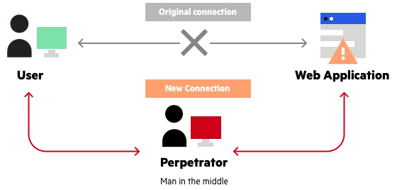
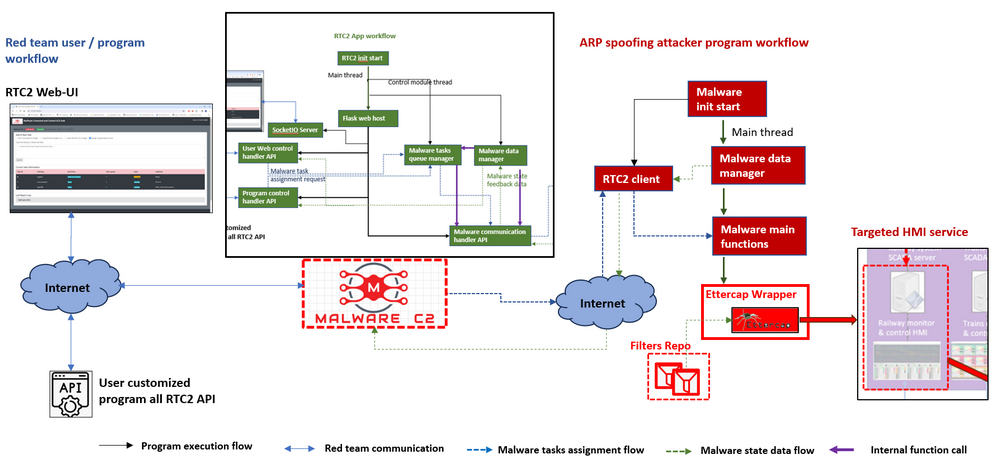
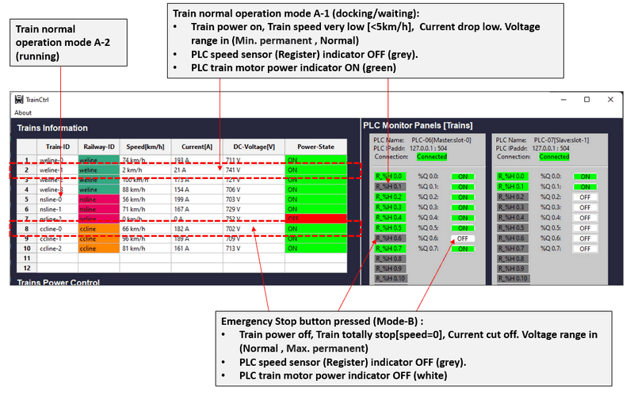
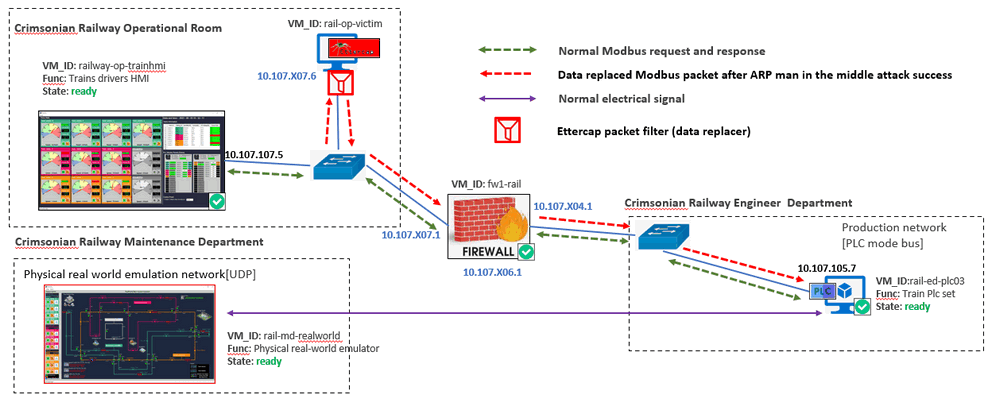
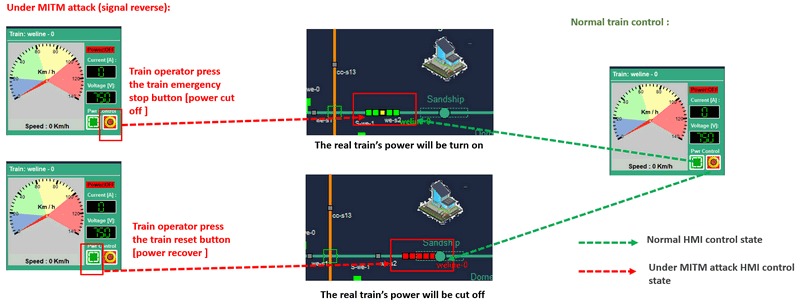
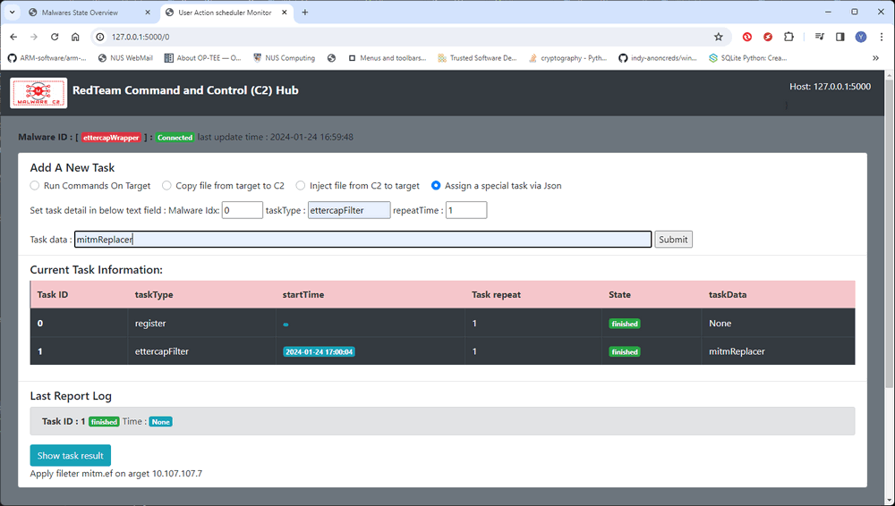

# OT Cyber Attack Demo on PLC [ Case Study 04 ] : Man in the middle Attack Case

**Project Design Purpose** : The objective of this case study is to develop a workshop which utilizing the Railway (Metro) IT/OT System Cyber Security Test Platform (mini cyber range), the Red Team Command and Control (C2) System and the Ettercap Wrapper for demonstrating the Man-in-the-Middle (MitM) attack on OT system.  Our aim is to showcase how a hacker (cyber range red team member) could potentially launch an MitM attack to modify the control command between HMI and PLC to caused the train accident situation. This particular attack scenario is proposed as one of the demonstration cases for the Cross Sword 2023 Test-Run, providing a realistic and controlled environment to assess the cybersecurity resilience of the railway infrastructure. It is a advanced ARP spoofing attack scenario of the [Case Study 2](OT_attack_case2_arpSpoofingAttack.md) and the Mitm is more difficulty for the operator to detect. 

**Attacker Vector** :  Man-in-the-Middle (MitM) attack / ARP Spoofing

> Important : The demonstrated attack case is used for education and training for different level of IT-OT cyber security ICS course, please don't apply it on any real world system.

[TOC]

------

### Introduction

The attack study case comprises three sub-projects :

- Railway[Metro] IT/OT System Mini Cyber Range System [> Link of project document](https://github.com/LiuYuancheng/Railway_IT_OT_System_Cyber_Security_Platform)
- Red Team C2 Emulation system [link of project document](https://github.com/LiuYuancheng/Python_Malwares_Repo/tree/main/src/c2Emulator)
- Ettercap Wrapper program [link of project document](https://github.com/LiuYuancheng/Python_Malwares_Repo/tree/main/src/ettercapWrapper)

In this study case, we envision a scenario where a red team attacker/hacker successfully implants the packet parser and data replacer (a wrapper program of MITM Tool Ettercap) via an IT-Network-Attack (such as employing a phishing email) which targeting one of the maintenance computers in the SCADA supervision network.  The attack study case will illustrate how a red team attacker ( who is external of the railway mini cyber range ) executes Ettercap wrapper to launch the ARP spoofing attack first, then use apply the Modbus packet parser to find the specific PLC control data stream, then use the replacer to modify the PLC coils' control bytes to reverse the final electrical signal control in the real world. This will be accomplished by utilizing the Red Team C2 system from the internet and successfully bypassing the firewall's detection mechanisms.

The attack detailed road map is shown below : 


#### Key Tactics, techniques, and procedures (TTP) of the attack

Based on the attack detailed road map there will 4 kinds TTP are included in the Man-in-the-Middle attack scenario : 

##### ARP Spoofing and Poisoning 

- **Tactic:** Redirecting network traffic by manipulating Address Resolution Protocol (ARP) tables.
- **Technique**: Broadcasting fake ARP messages to associate the attacker's MAC address with the IP address of a legitimate device, causing traffic to be redirected through the attacker.
- **Procedures**: The Mitm attack program will use Ettercap to launch APR spoofing attack to redirect the HMI to PLC message to the attack host first, then forward the modified packet to the PLC. 

##### Packet Injection and modification

- **Tactic**: Introducing malicious packets into the communication stream or modify the normal packet .
- **Technique**: Injecting crafted packets into the network to manipulate data, disrupt communication, or execute unauthorized commands.
- **Procedures**: The Mitm attacker will use the packet data replace filter to modify the trains' power control bytes in the HMI-PLC Modbus-TCP communication steam, then inject the crafted packet to the related PLC to mess up the PLC's control sequence.

##### Remote Attack Control

- **Tactics** : Centralized Program Control  
- **Techniques** : Use a Red Team Command and Control (RTC2) system that enables attackers to manage and control compromised systems/nodes/devices.
- **Procedures**: The red team attackers will remotely control the Malicious-Action-Programs through RTC2's web-UI/http-API, the attack control can be from any location of the internet. 

##### Camouflage the Communication

- **Tactics** : Traffic Encryption and Obfuscation
- **Techniques** : Using encryption algorithms to protect RTC2 control messages and employing obfuscation methods to make the encrypted data more challenging to be interpreted.
- **Procedures :** To camouflage the communication, all interactions between the Malicious-Action-Programs and the Command and Control (C2) system will be disguised as standard HTTPS POST requests and responses, the key control message will be encrypted via pre-set session key. Notably, the package size will be kept minimal (less than 1KB) to prevent triggering the firewall's alert mechanisms related to download/upload activities.


------

### Background Knowledge 

Within this section, we aim to provide fundamental, general knowledge about each respective system and elucidate the Tactics, Techniques, and Procedures (TTP) associated with the attack vectors. This foundational information will serve as a primer for understanding the intricate details of the systems involved and the methodologies employed in the attack scenarios.

##### Man-in-the-Middle (MitM) attack for data modification

A man in the middle (MITM) attack is a general term for when a perpetrator positions himself in a conversation between a user and an application—either to eavesdrop or to impersonate one of the parties, making it appear as if a normal exchange of information is underway. A general MITM attack diagram is shown below :



Reference: https://www.imperva.com/learn/application-security/man-in-the-middle-attack-mitm/

MitM attacks can be executed in various ways, In our case study scenario, the main attack vector is Packet Injection and modification (data modification). Generally there will be 5 steps for a hacker/red team attacker to implement a successful Mitm data modification attack:

**Interception:** The attacker positions themselves between the communication channels of two parties. This could happen on a network, at a Wi-Fi hotspot, or even through compromised network devices.

**Packet Sniffing:** The attacker captures the data packets passing between the two parties. This could include login credentials, sensitive information, or any other data being transmitted.

**Data Modification:** The attacker can modify the intercepted data packets to suit their malicious objectives. For example, they could change the content of an email, alter the details of a financial transaction, or manipulate any other information being transmitted.

**Delivery:** The modified data is then delivered to its intended recipient, who is unaware that the information has been tampered with.

**Avoiding Detection:** To avoid detection, the attacker might also modify the data in a way that seems plausible and consistent with the overall communication. For example, they might alter the amount in a financial transaction to a reasonable sum to avoid immediate suspicion.

The main data flow of a successful mitm attack example is shown below:


##### Railway[Metro] IT/OT Mini Cyber Range System

For the Railway IT/OT System general introduction please refer refer to the [study case 1](OT_attack_case1_falseCmdInjection.md), the cyber range system diagram is shown below:


The attack scenario will focus on the attack the control chain between the Train-Control HMI and Trains Control PLC sets. For our cyber range design, to support multiple HMI control and control management, our HMI program provide 2 mode: master and slave mode. The UI of the HMI master and slave is shown below (for master mode UI detail please refer to [case study 3](https://www.linkedin.com/pulse/ot-cyber-attack-workshop-case-study-03-ddos-plc-yuancheng-liu-yi2cc%3FtrackingId=0mN7YD95Q9%252BxzWdRn1IF%252BQ%253D%253D/?trackingId=0mN7YD95Q9%2BxzWdRn1IF%2BQ%3D%3D)) : 


**Master Mode Train Control HMI**: The master node HMI is controlled by train HQ Operator, the node will connect to PLC directly, it has full control of the PLC and can monitor all the information from PLC. All the slave mode HMI will connect to the master node and fetch data and send cmd, the master node can identify and limit the data can be displayed on the slave node and whether the slave node can control the PLC. 

**Slave Mode Train Control HMI**: The slave node HMI is controlled by the maintenance engineer or the railway operation safety checker, the slave nodes are not connected to PLC, then will fetch the data from master node and send the control request to master node to forward to the PLC, so the master node will control what kind of data a slave node can view and which PLC a slave node can control. 

For PLC side, only one master node can connect to it and do the full train control. the control sequency for a master node and multiple slave node is shown below, in the case study, the control channel between the master HMI node and the related PLC is the attack target : 


For the HMI system detail please refer to this document : [Trains Control HMI Doc](https://github.com/LiuYuancheng/Railway_IT_OT_System_Cyber_Security_Platform/blob/main/doc/trainsCtrlHMI.md)


##### Red Team C2 Emulation System And Ettercap Wrapper

For the The Red Team Command and Control (RTC2) server, please refer to the introduction in case study 1

The Ettercap wrapper MITM malware is designed for red team attackers applying different kinds of packet data replacer on the network traffic ( router/switch ) via Ettercap's ARP spoofing function.  The MITM  attacker is extended from the standard c2BackdoorTrojan module `<c2TestMalware>` by adding our customized Ettercap Wrapper module, so the C2 Emulation system can control it broadcast the specific ARP poisoning message to the railway HMI nodes, the operational room subnet's switch/router and even the related connected PLC sets. The RTC2 control and attack workflow is shown below: 



The attacker will apply a packets data replacement filter to the traffic between the Train Control HMI and one PLC sets (train control plc) to reverse some bits in the HMI -PLC control commands.

> Ettercap wrapper attack program repo: [GitHub Repo ](https://github.com/LiuYuancheng/Python_Malwares_Repo/tree/main/src/ettercapWrapper)
>
> Train Control PLC design document: [Doc link](https://github.com/LiuYuancheng/Railway_IT_OT_System_Cyber_Security_Platform/blob/main/doc/trainsPlcSimu_readme.md)


------

### Railway Operation and Attack Procedures 

#### Train Operation Basic Background Knowledge Introduction 

There will be a brief workshop to precede the implementation of the attack, providing an introduction to the fundamental control aspects of trains within the railway system. The cyber range network topology please refer to the previous 3 case study.

For the train HMI and PLC control part, two PLC (PLC-06, PLC-07) are involved in this scenario, PLC-06 is the master and PLC-07 is the salve. This program is used to control the railway's station system. There will be 10 input and 10 output and 0 ladder logic in this PLC set. The PLC to real world elements and PLC to HMI control workflow is shown in the below diagram: 

 

For the detail document, please refer to this document [Train PLC workflow doc](https://github.com/LiuYuancheng/Railway_IT_OT_System_Cyber_Security_Platform/blob/main/doc/trainsPlcSimu_readme.md)

The Man-in-the-Middle attack will make influence two part of the HMI train control: 

##### Train power control (Emergency stop and power recover) function

Press the "Green power on" button to turn on the power or "Red emergency stop" button to turn off the train power when the HMI connected to the PLC. When power is changed, a confirm message dialog will pop-up as shown below:


>  Attack case : The MITM attack program will try to reverse the operator's power control instruction. 

##### Train Operation Feedback Data display function

The plc feed back data and state will be displayed on different information panel of the HMI as shown below:



> Attack case : the MITM attack program will try to also reverse the feedback power state so the operator can not detect the exception state happening.


#### OT-Cyber-Attack Procedures 

In this demo, the attack tool Ettercap will be pre-installed by the previous IT-system-attack. As introduced in the previous section, we are required to implement 2 types of attack : Man in the middle attack and data modification. The effected VMs in the OT network is shown below: 



The attack demo will show the red team attack sniffed some of the packet between HMI and PLC, then check which bytes is the PLC coils control data, as shown below example, the find that the byte Idx 34 and 35 is used to control the PLC coil 05:


Then attacker will use the filter to detect the head part of the packet to identify whether the packet is a PLC coil control request, then apply apply a packets data replacer (As the simple example shown below) :

```
#-----------------------------------------------------------------------------
# Name:        arp_mitm.filter
#
# Purpose:     This filter is used to do the arp man in the middle attack to 
#              reverse the Modbus control signal of train weline-00.
#
# Author:      Yuancheng Liu
#
# Version:     v_0.1
# Created:     2023/10/02
# Copyright:   
# License:     
#-----------------------------------------------------------------------------

if (ip.proto == TCP  && tcp.dst == 502 && ip.dst == '10.107.105.7') {

    if (search(DATA.data ,"\x00\x06\x01\x05\x00\x00\x00\x00")) {
        replace("\x00\x06\x01\x05\x00\x00\x00\x00", "\x00\x06\x01\x05\x00\x00\xff\x00");
        msg("Reverse train weline-00 power off signal.\n");
        exit();
    }

    if (search(DATA.data ,"\x00\x06\x01\x05\x00\x00\xff\x00")) {
        replace("\x00\x06\x01\x05\x00\x00\xff\x00", "\x00\x06\x01\x05\x00\x00\x00\x00");
        msg("Reverse train weline-00 power on signal.\n");
        exit();
    }
}
```

Then the attacker's program is able to reverse one of the trains' power control signal.

To reverse the PLC feed back data, the hacker do the same thing to reverse the power sensor feed back as shown below: 


**Observation during the attack :**

When the attack happens, the railway train HQ operator will observe below situation (if he also check the real world emulator's sate) :

- If the train operator press the train `weline-0` “power on” button the train’s power will be cut off.
- If the train operator press the train `weline-0` “power off” button the train’s power will be turn on.

But from the HMI, the HMI the trains power state shows every thing normal. The attack effect (observation) detail is shown below:




------

### Red Team Attack Detail Steps

Given that the red team attackers operate outside the railway cyber range network, they rely on the attack control Command and Control (C2) system to execute the assault. As detailed in the Attack Pre-condition Introduction section, the ARP spoofing attacker program has been previously deployed on one of the maintenance computers within the cyber range. Consequently, when the red team attacker accesses the C2 system, they will see the Mitm attacker program "EttercapDropper" has been registered in the C2 as shown below : 


##### Start Man-in-the-Middle Attack data replacer from C2

Select the ettercapWrapper control page, then select the **Assign a special task via Json**, then fill in the task detail : 

- TaskType: `ettercapFilter`
- Repeat: `1`
- Tasks data: `mitmReplacer <filter name>`



Press the `submit` button, when the Ettercap wrapper report the task running,the Ettercap will applied the filter to keep block the traffic which incoming or outgoing the target. For the target information, please refer to the filter.json file, below is one dropper filter example, you can create your own filter and put in the filters folder and give a filter unique name in the filter.json file so you can apply it on the traffic:

```
"mitmReplacer" : {
	"ipaddress": "10.107.107.7",
	"protocalType": "TCP",
	"port":502,
	"description": "Replace the specific bytes data in the HMI-PLC ModBus-Tcp communication channel to reverse the HMI control cmd",
	"filterFile": "mitm.ef"
}
```


##### Mitm attack  (packet data modify) demo video

To check the demo video, please refer to this link in my you tube channel: https://www.youtube.com/watch?v=fUC-DeNE_oM


------

#### Problem and Solution

Refer to `doc/ProblemAndSolution.md`


------

> Last edit by LiuYuancheng(liu_yuan_cheng@hotmail.com) at 25/01/2024, if you have any problem, please send me a message.  Copyright (c) 2023 LiuYuancheng